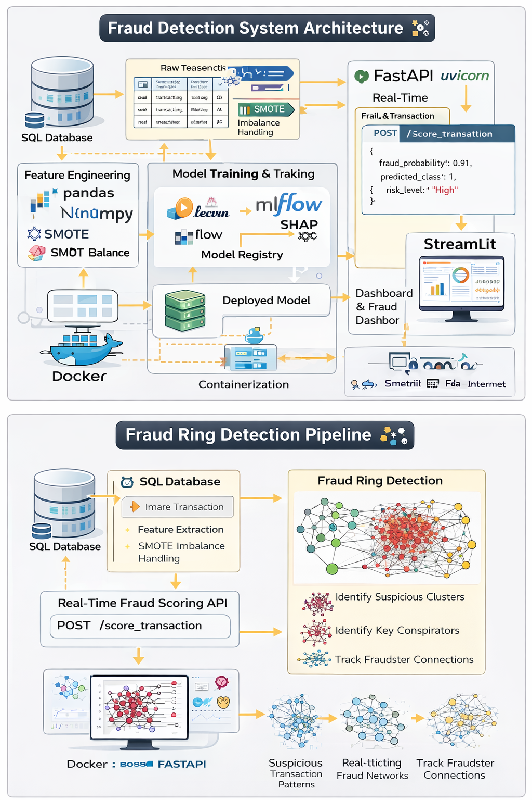
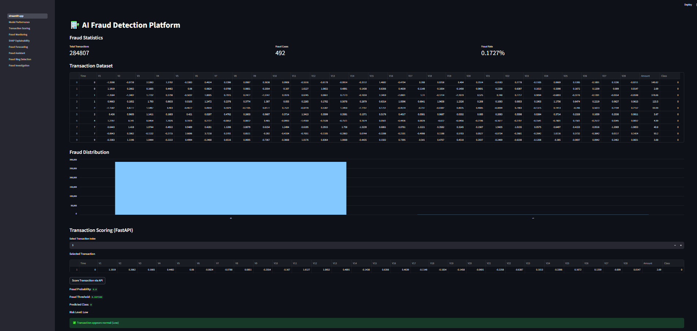
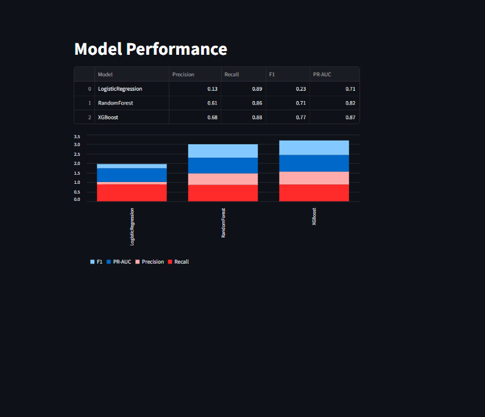
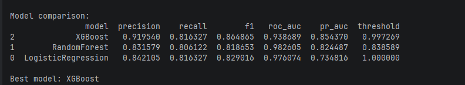
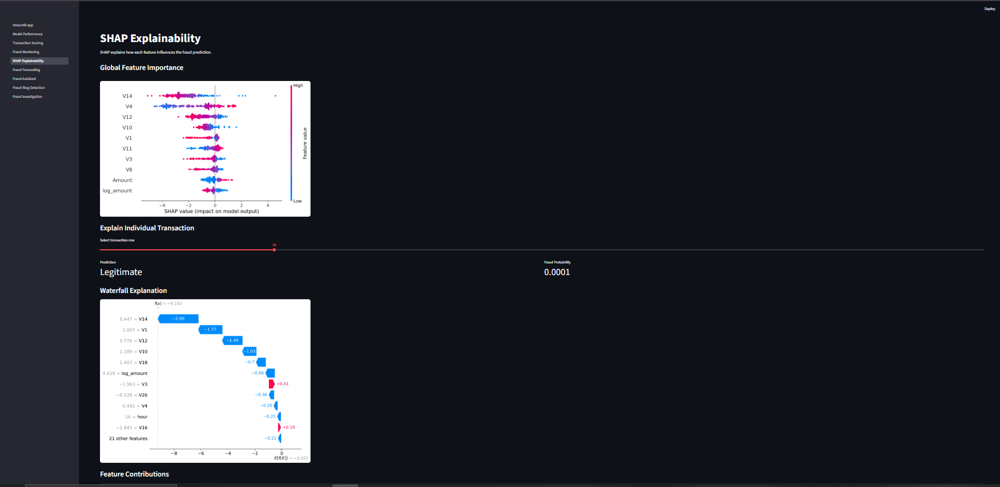
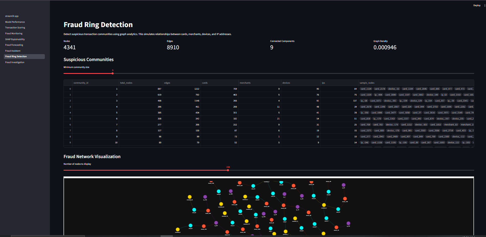

# AI Banking Fraud Detection Platform

An end-to-end **Machine Learning Fraud Detection System** built with
**Python, SQL, MLflow, FastAPI, Streamlit, and Network Analysis** to
detect fraudulent financial transactions and fraud rings in real time.

This project demonstrates a **production-style ML system** including
data engineering, model training, explainability, API deployment, and
interactive dashboards.

------------------------------------------------------------------------

# System Architecture

The platform integrates multiple components:

• Data Storage -- Transaction data stored in SQL database\
• Feature Engineering -- Transaction features extracted and transformed\
• Machine Learning Models -- Fraud detection using supervised learning\
• MLflow Tracking -- Experiment tracking and model management\
• FastAPI Service -- Real-time fraud scoring API\
• Streamlit Dashboard -- Interactive monitoring interface\
• Explainable AI -- SHAP explainability for model decisions\
• Fraud Network Detection -- Graph-based fraud ring analysis

------------------------------------------------------------------------

# Dashboard Preview

### Dashboard Overview

### Model Performance

### Model Comparison

### SHAP Explainability

### Fraud Ring Detection

------------------------------------------------------------------------

# Machine Learning Pipeline

1.  Data ingestion\
2.  Data preprocessing\
3.  Feature engineering\
4.  Handling class imbalance (SMOTE)\
5.  Model training\
6.  Model evaluation\
7.  Experiment tracking with MLflow\
8.  Model deployment via FastAPI

------------------------------------------------------------------------

# Real-Time Fraud Scoring API

The platform exposes a **FastAPI scoring service**.

Endpoint:

POST /score_transaction

Example response:

{ "fraud_probability": 0.91, "predicted_class": 1, "risk_level": "High"
}

------------------------------------------------------------------------

# Fraud Ring Detection

Fraudsters often operate in collaborative networks.\
This system detects suspicious transaction clusters using graph
analytics.

------------------------------------------------------------------------

# Explainable AI (SHAP)

To ensure transparency, SHAP values are used to explain model
predictions.

This allows investigators to understand why a transaction was flagged as
fraudulent.

------------------------------------------------------------------------

# Technology Stack

  Category              Tools
  --------------------- ---------------
  Programming           Python
  Data Processing       Pandas, NumPy
  Machine Learning      Scikit-learn
  Experiment Tracking   MLflow
  API                   FastAPI
  Dashboard             Streamlit
  Explainability        SHAP
  Graph Analysis        NetworkX
  Containerization      Docker

------------------------------------------------------------------------

# Project Structure

fraud-detection-platform │ ├── api/ \# FastAPI fraud scoring API ├──
app/ \# Streamlit dashboard ├── data/ \# Dataset ├── databases/ \# SQL
database files ├── src/ \# ML training pipeline ├── models/ \# Trained
models ├── Images/ \# README screenshots ├── docker-compose.yml ├──
Dockerfile └── README.md

------------------------------------------------------------------------

# Running the Project

### Clone repository

git clone https://github.com/mukosimashudu/fraud-detection-platform.git

### Install dependencies

pip install -r requirements.txt

### Train models

python -m src.train

### Run API

uvicorn api.main:app --reload

### Run dashboard

streamlit run app/streamlit_app.py

------------------------------------------------------------------------

# Future Improvements

• Real-time streaming fraud detection\
• Graph neural networks for fraud rings\
• Cloud deployment (AWS / Azure)\
• CI/CD MLOps pipeline

------------------------------------------------------------------------

# Author

**Mashudu Mukosi**\
Data Scientist \| Machine Learning Engineer

GitHub\
https://github.com/mukosimashudu
